---

layout: default

---

# Slides are based on Markdown

## Headings

Paragraphs _with_ **formatting**.

- Bullet list item 1
- Bullet list item 2
- Bullet list item 3

> Quotes


```javascript
console.log("Code blocks are supported too!");
```


---

# Mermaid diagrams 🧜‍♀️

```mermaid
---
title: Simple Diagram
---
graph LR
    A[Look]
    B[at]
    C[this]
    D[diagram 🤩]
    A --> B --> C -.->|beautiful| D
```



```txt
---
title: Simple Diagram
---
graph LR
    A[Look]
    B[at]
    C[this]
    D[diagram 🤩]
    A --> B --> C -.->|beautiful| D
```